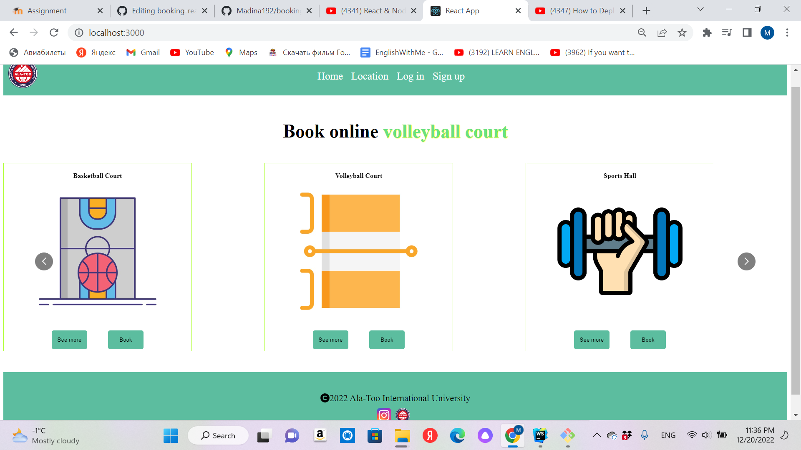
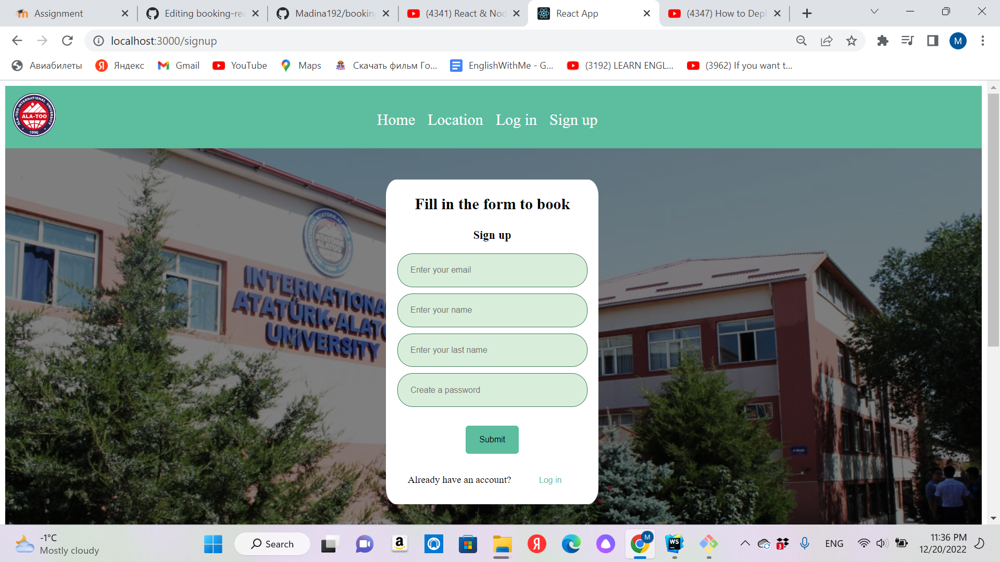
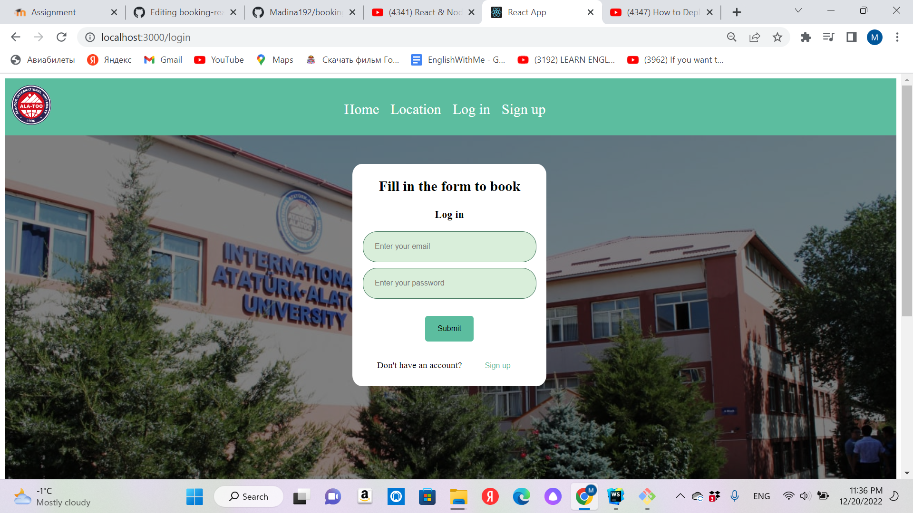
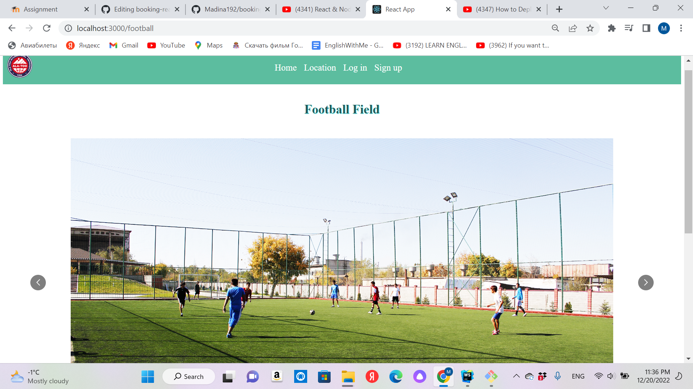

# Booking website for Ala-Too International University

## I created this website on React JS.
## Since I'm alone in the team, I did frontend. But I also wrote backend using Node JS, Express JS, PostgreSQL, it works, but couldn't connect to frontend.
## Link to website: 
## Link to research: https://drive.google.com/file/d/1oG_KnNiEgz4tBHDxBl-yF_-NHi11VVtB/view?usp=sharing
## Home page
## There is carousel of booking places at our university:

## Sign up page:
## You can sign up on this page by entering your email, name, last name and password, it saves your name to localStorage:

## Login page:

## When you click "see more" button in a specific box on home page, you go to the page where you can book it:

## Book page
## There are some photos and on the bottom there is button "choose date"

