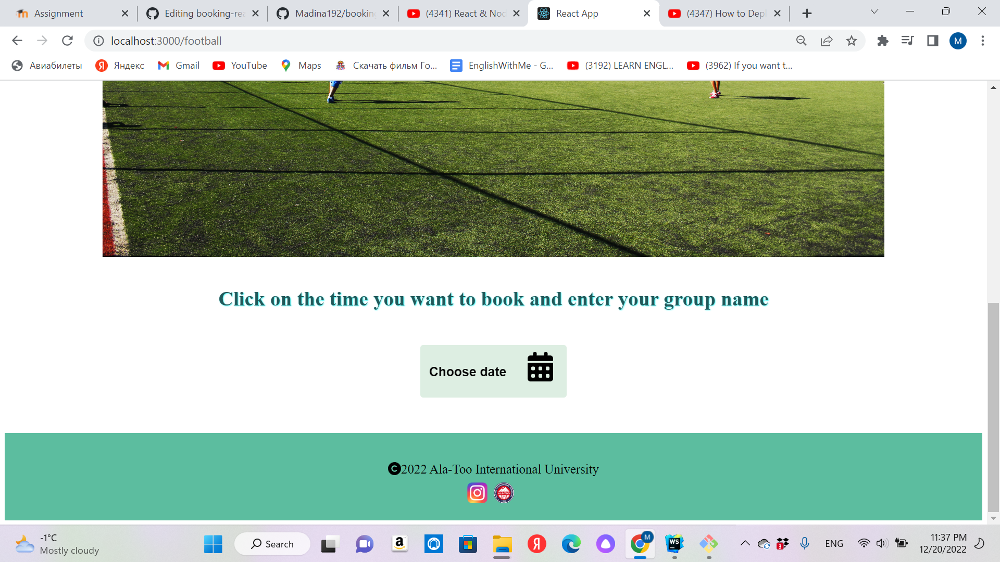
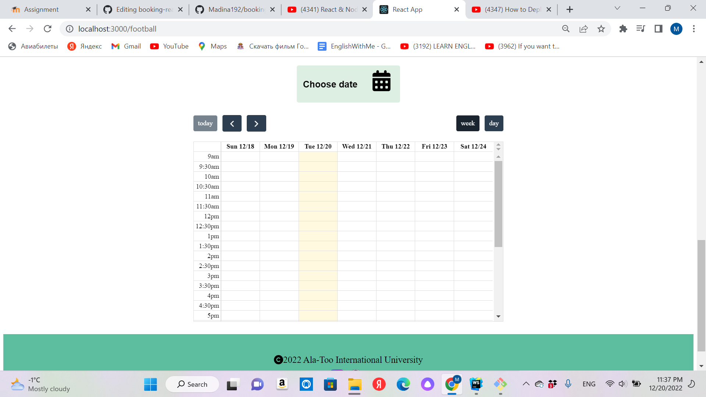
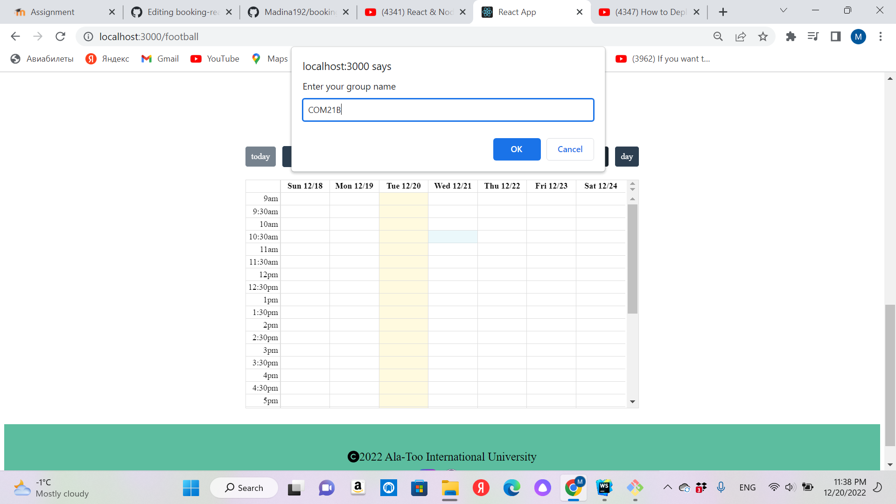
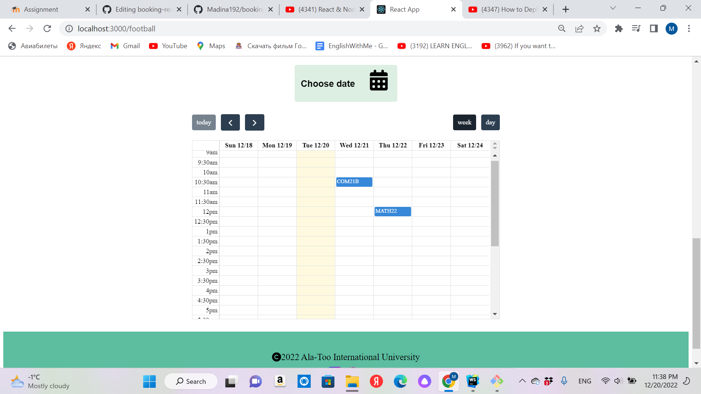
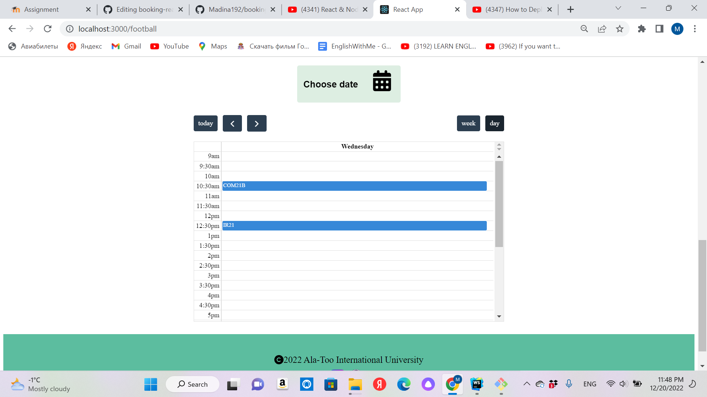
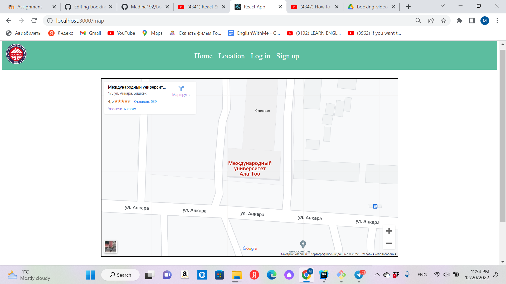

# Booking website for Ala-Too International University

## I created this website on React JS.
## Since I'm alone in the team, I did frontend. But I also wrote backend using Node JS, Express JS, PostgreSQL, it works, but couldn't connect to frontend, it's in server folder.
## Link to website: https://madina192.github.io/
## Link to research: [https://drive.google.com/file/d/1oG_KnNiEgz4tBHDxBl-yF_-NHi11VVtB/view?usp=sharing](https://youtu.be/Eu4Q-w8HLu8)
https://docs.google.com/spreadsheets/d/1edXRKym1vLBOWFwqievEdhlVD8wulvhV3fTdvstwMuQ/edit#gid=726709099
## Home page
## There is carousel of booking places at our university:

## Sign up page:
## You can sign up on this page by entering your email, name, last name and password, it saves your name to localStorage:

## Login page:

## When you click "see more" button in a specific box on home page, you go to the page where you can book it:

## Book page
## There are some photos and on the bottom there is button "choose date":

## If you click the button, you'll see calendar for booking. When you click any time a new box with an input appears, where you enter your group name, then you'll see your group name on calendar.

## You can choose week or day calendar on the top of the box:

## Location page
## It's location of our university:

